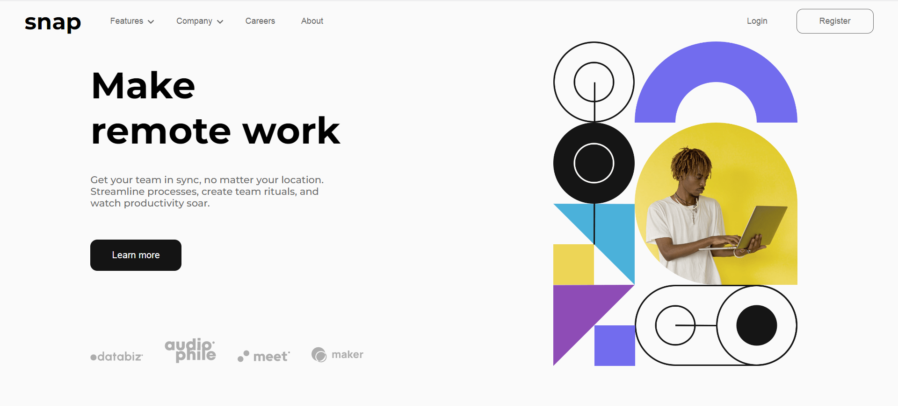
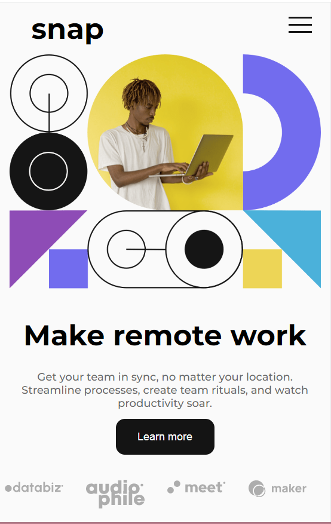
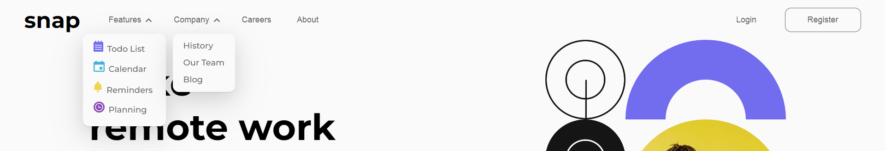

# Intro section with dropdown navigation solution

## Table of contents

- [Overview](#overview)
  - [Screenshot](#screenshot)
  - [Links](#links)
- [My process](#my-process)
  - [개발목표](#개발목표)
  - [Built with](#built-with)
  - [Advanced feature](#Advanced-feature)
  - [What I learned](#what-i-learned)
  - [개선사항](#개선사항)

## Overview

### Screenshot

- Web design  
  
- Mobile design  
  
- 실행 화면  
  

### Links

- Solution URL: [Github Repository](https://github.com/sagekim6/dropdown-navigation.git)
- Live Site URL: [https://sagekim6.github.io/dropdown-navigation/](https://sagekim6.github.io/dropdown-navigation/)

## My process

### 개발목표

- 리액트와 sass 사용의 이해와 미디어 쿼리를 사용한 반응형 웹페이지 구축.

### Built with

- Semantic HTML5 markup
- Scss
- Flexbox
- Media query
- [React](https://reactjs.org/)

### Advanced feature

1. 리액트 컴포넌트를 사용한 네비게이션 메뉴 개발

- Web version  
  
- Mobile version  
  
- `useEffect` 훅을 사용해 "resize" 이벤트를 감지해서 화면의 넓이가 768px 이하일 때 모바일 메뉴 버튼이 나타나도록 개발했습니다.

```javascript
const Header = () => {
  const [width, setWidth] = useState(window.innerWidth);

  const handleWidth = (e) => {
    setWidth(e.target.innerWidth);
  };

  useEffect(() => {
    window.addEventListener("resize", handleWidth);
    return () => {
      window.removeEventListener("resize", handleWidth);
    };
  }, []);

  return (
    <header>
      <h1>snap</h1>
      {width <= 768 ? (
        <>
          <MobileMenu />
        </>
      ) : (
        <>
          <Navigation />
        </>
      )}
    </header>
  );
};
```

2. 리액트 훅을 사용해 불필요한 렌더링 최소화

- Features, Company 버튼 클릭시 다른 버튼들도 불필요하게 렌더링 되는 것을 `memo` 훅을 사용해 최소화하였습니다.

```javascript
import { useState, memo } from "react";

const Navigation = () => {
  const [isFeaturesClicked, setIsFeaturesClicked] = useState(false);
  const [isCompanyClicked, setIsCompanyClicked] = useState(false);

  const handleFeaturesClicked = () => {
    setIsFeaturesClicked(!isFeaturesClicked);
  };
  const handleCompanyClicked = () => {
    setIsCompanyClicked(!isCompanyClicked);
  };

  // memo 훅을 사용해 컴포넌트 자체를 wrapping
  const CareersMemo = memo(Button);
  const AboutMemo = memo(Button);
  const LoginMemo = memo(Button);
  const RegisterMemo = memo(Button);

  return (
    <nav className={"desktop_nav"}>
      <div className="nav_btns">
        {/*
       
       다른 코드들...
       
       */}
        <CareersMemo text="Careers" className={["Careers"]} />
        <AboutMemo text="About" className={["About"]} />
      </div>
      <div className="Login_Register">
        <LoginMemo text="Login" className={["Login"]} />
        <RegisterMemo text="Register" className={["Register"]} />
      </div>
    </nav>
  );
};

export default memo(Navigation); // Navigation 컴포넌트 자체도 미리 wrapping 해서 export하였다.
```

3. 자주 사용되는 기능을 컴포넌트로 만들어 재사용성 높이기

- 프로젝트에서 버튼이 많이 사용되어서 따로 컴포넌트로 만들어 재사용성을 높였습니다.
- 다양한 prop을 받고 기본값을 미리 지정해서 값이 제대로 전달되지 않으면 기본값이 할당되도록 개발했습니다.

```javascript
const Button = ({
  text = "",
  className = [],
  onMouseEvent = () => {},
  handleFeaturesClicked = () => {},
  handleCompanyClicked = () => {},
}) => {
  const classArr = className.join(" ");
  const handleClick = () => {
    handleFeaturesClicked();
    handleCompanyClicked();
  };
  return (
    <button
      onMouseOver={onMouseEvent}
      onMouseLeave={onMouseEvent}
      onClick={handleClick}
      className={classArr}
    >
      {text}
    </button>
  );
};

export default Button;
```

### What I learned

#### 1. `Too many re-renders.` error

- 초반에 App.js 파일에서 작성한 코드이다. 이후에 수정된 부분이지만 처음 만난 에러였다.

```javascript
function App() {
  const [isClicked, setIsClicked] = useState(false);

  const handleIsClicked = setIsClicked(!isClicked); // 여기가 문제!

  return (
    <>
      <Header isClicked={isClicked} handleIsClicked={handleIsClicked} />
      <Main />
    </>
  );
}

export default App;
```

- state가 바뀌는 함수가 있다면 렌더링되는 과정에서 계속 리렌더링되기 때문에 `Too many re-renders.` error가 난다.

```javascript
const handleIsClicked = () => {
  setIsClicked(!isClicked); // 화살표 함수 사용
};
```

- 화살표 함수로 만들어 주면 간단하게 해결된다.

#### 2. `SVG` image 사용

- `SVG` 포멧이란?

  - 수학적 함수를 이용하여 도형이나 선을 그려서 표시하는 방식으로 이미지를 그린다. 확대했을 때 선명함을 유지하고 용량도 작다는 장점이 있다.

- `SVG`를 사용하는 방법은 여러 가지지만 이 프로젝트에선 컴포넌트 형태로 import 해서 사용해주었다.  
  `import { ReactComponent as ArrowUp } from "../images/icon-arrow-up.svg";`

### 개선사항

1. 메뉴가 펼쳐질 때 애니메이션을 적용해 좀 더 부드러운 효과를 주어 긍정적인 사용자 경험을 주도록 하기.
